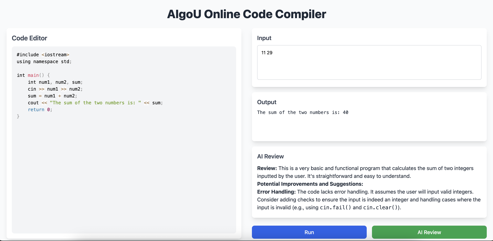

# Online Judge Platform ⚖️💻


## Overview

The Online Judge Platform is a modern web-based environment for compiling, running, and evaluating C++ code. It is designed with real-time execution, AI-based code reviews, and a clean interface to help developers practice and improve problem-solving skills efficiently.

## Screenshots

### Main Interface


### Code Editor


### Problem Solving Interface


### Results Display


### Mobile Responsive Design


### Platform Overview


## Features

- **Code Editor**: Write, edit, and format C++ code with syntax highlighting
- **Real-time Execution**: Instantly compile and run code inside a secure backend environment
- **Custom Input**: Provide user-defined input during code execution
- **AI Code Review**: Receive smart feedback and suggestions using Google's Gemini AI
- **Problem Bank**: Browse and attempt a growing set of coding problems
- **Responsive Design**: Fully responsive UI optimized for desktop and mobile

## Tech Stack

### Frontend
- React.js
- Tailwind CSS
- Axios for API requests
- React Simple Code Editor
- Prism.js for code syntax highlighting
- React Markdown for displaying AI reviews

### Backend
- Node.js
- Express.js
- Google Gemini AI API for intelligent code feedback
- C++ compiler integration with Docker sandboxing

## Installation and Setup

### Prerequisites
- Node.js (v16+)
- npm or yarn
- C++ compiler installed
- Docker (optional for sandbox execution)

### Backend Setup

1. Navigate to the backend directory:
   ```bash
   cd backend
   ```

2. Install dependencies:
   ```bash
   npm install
   ```

3. Create a `.env` file in the backend directory:
   ```env
   PORT=5000
   GEMINI_API_KEY=your_gemini_api_key_here
   ```

4. Start the backend server:
   ```bash
   npm start
   ```

### Frontend Setup

1. Navigate to the frontend directory:
   ```bash
   cd frontend
   ```

2. Install dependencies:
   ```bash
   npm install
   ```

3. Start the development server:
   ```bash
   npm start
   ```

4. Open your browser and navigate to `http://localhost:3000`

## Usage

### Running Code
1. Write your C++ code in the editor
2. Provide custom input if needed
3. Click "Run Code" to execute
4. View the output and execution results

### AI Code Review
1. After writing your code, click "Get AI Review"
2. Receive intelligent feedback and suggestions
3. Implement improvements based on AI recommendations

### Problem Solving
1. Browse available problems in the problem bank
2. Select a problem to attempt
3. Write your solution in the code editor
4. Test with provided test cases
5. Submit for evaluation

## API Endpoints

### Code Execution
- `POST /api/execute` - Execute C++ code
  ```json
  {
    "code": "C++ code string",
    "input": "optional input string"
  }
  ```

### AI Review
- `POST /api/review` - Get AI code review
  ```json
  {
    "code": "C++ code string"
  }
  ```

### Problems
- `GET /api/problems` - Get all problems
- `GET /api/problems/:id` - Get specific problem
- `POST /api/problems/:id/submit` - Submit solution

## Project Structure

```
online-judge-platform/
├── frontend/
│   ├── src/
│   │   ├── components/
│   │   ├── pages/
│   │   ├── utils/
│   │   └── App.js
│   ├── public/
│   └── package.json
├── backend/
│   ├── routes/
│   ├── controllers/
│   ├── middleware/
│   ├── utils/
│   ├── server.js
│   └── package.json
└── README.md
```

## Security Features

- **Sandboxed Execution**: Code runs in isolated Docker containers
- **Resource Limits**: CPU and memory constraints for safe execution
- **Input Validation**: Sanitized user inputs to prevent injection attacks
- **Rate Limiting**: API request throttling to prevent abuse

## Contributing

1. Fork the repository
2. Create a feature branch (`git checkout -b feature/amazing-feature`)
3. Commit your changes (`git commit -m 'Add some amazing feature'`)
4. Push to the branch (`git push origin feature/amazing-feature`)
5. Open a Pull Request

## Future Enhancements

- [ ] Support for multiple programming languages (Python, Java, JavaScript)
- [ ] User authentication and profiles
- [ ] Contest mode with leaderboards
- [ ] Advanced problem difficulty classification
- [ ] Code collaboration features
- [ ] Performance analytics and insights


---

**Happy Coding! 🚀**
